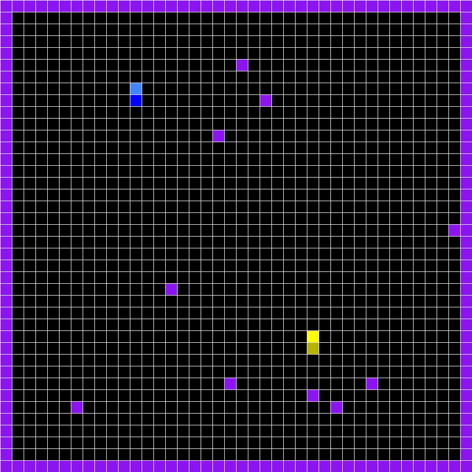

# AudricTron : An AI-Powered Tron Game 🏍️

AudricTron is a Pygame implementation of the classic Tron game, enhanced with AI capabilities using Keras. This project allows players to control the game using keyboard inputs, random movements, or an AI that can be trained and retrained during gameplay.


## Table of Contents

- [AudricTron : An AI-Powered Tron Game 🏍️](#audrictron--an-ai-powered-tron-game-️)
  - [Table of Contents](#table-of-contents)
  - [Introduction](#introduction)
  - [Démo](#démo)
  - [Features](#features)
  - [Game Options](#game-options)
    - [Control Modes](#control-modes)
    - [Other Options](#other-options)
  - [Installation](#installation)
  - [Usage](#usage)
  - [Acknowledgments](#acknowledgments)


## Introduction

AudricTron is inspired by the classic Tron light cycle game and leverages AI to control player movements. This project was created by Audric Girondin, with inspiration from xenago and contributions from peterhogg.

## Démo 

<p align="center">
  
</p>

## Features

- **Multiple Control Modes**: Play using the keyboard, random movements, or AI-controlled players.
- **AI Training**: Train and retrain AI models using Keras during gameplay.
- **Customizable Game Options**: Adjust game settings such as speed, obstacles, and AI training parameters.
- **Visual Feedback**: Real-time game rendering using Pygame.

## Game Options

### Control Modes

- **keyboard**: Player 1 uses WASD keys, Player 2 uses arrow keys.
- **random**: Players move randomly.
- **ai_load_trained**: Loads a pre-trained AI model for decision making.
- **ai_retrain**: Loads a pre-trained AI model and continues training it during gameplay.
- **ai_train_random**: Creates a new AI model, trains it with random decisions, and saves the model.

### Other Options

- **filename**: Specify the filename for saving/loading the AI model (default: `"model_keras_audric.keras"`).
- **obstacles**: Number of obstacles in the game.
- **training_games**: Number of automatic training games to play.
- **games_before_training**: Number of games to play before training the AI.
- **speed**: Game refresh rate (higher values result in faster gameplay).

## Installation

1. Clone the repository:
   ```sh
   git clone https://github.com/aaudric/audrictron.git
   ```
2. Navigate to the project directory:
   ```sh
   cd audrictron
   ```
3. Install the required dependencies:
   ```sh
   pip install -r requirements.txt
   ```

## Usage

Run the game using Python:
```sh
python audricTron.py
```
Adjust game options directly in the `audricTron.py` file under the `# Options` section.

## Acknowledgments

This project was uptaded by Audric Girondin, created by the work of xenago (https://github.com/xenago) and with contributions from peterhogg (https://github.com/peterhogg/tron). Special thanks to these contributors for their inspiration and foundational work.
